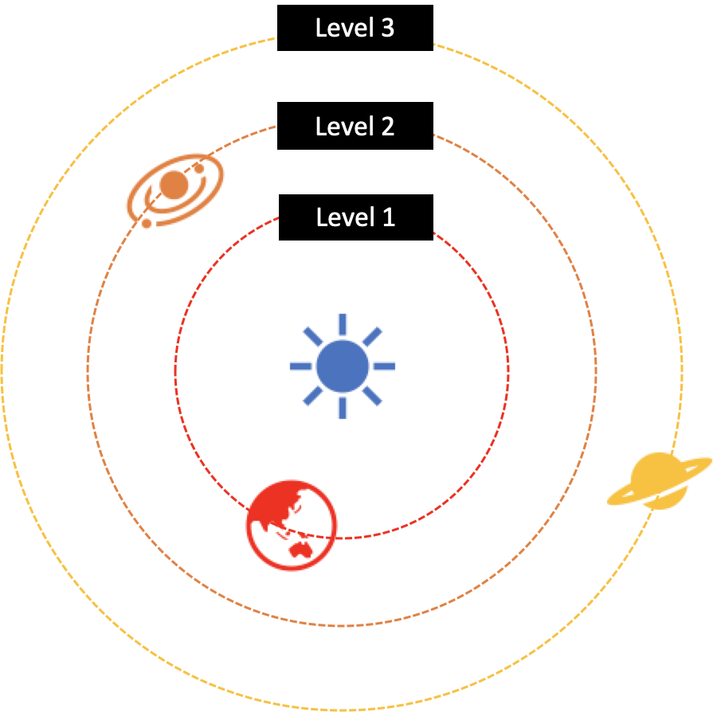

# Computer Graphics Term Project

> *  Dead Line: 2020/06/13 18:00
> * Presentation Date: 2020/06/17 23:59:59
> * Shared Date: 2020/06/18 14:30

## Requirement

> Your application must satisfy the following minimum technical requirements (70 pts):

- (10 pts) **Interaction** with a player (or players)
- (10 pts) **Moving** and/or **rotating** object(s)
- (10 pts) **Moving** and/or **rotating part(s)** in at least one object
- (10 pts) **Textured** object(s)
- (10 pts) Switch between two shading modes: **Phong** and **Gouraud**
- (10 pts) Interactively **picking** (or selecting) object(s)
- (10 pts) Any **special effect** or **simulation** (e.g., physics, particles, etc.)
- Any **bug** and incomplete implementation deduct points.
- Any additional implementation like **collision detection** among 3D objects and significant efforts for implementing **gamification ideas** can be considered for extra credits (up to 10 pts). The standard for valuation on the gamification idea is as follows (20 pts):
  - \-  (10 pts) **Creativity** / **Originality / Quality of Game Elements**
  - \-  (10 pts) **Expected impact** on the related area
- The followings are additional items to be evaluated (50 pts):
   - (10 pts) Overall technical quality
  - (40 pts) Quality of the Final Report and Final Video (See Section 4)

## Shrink Planent

### Sample Video

* Shrinking Planet Copy Cat
  * [영상](https://www.youtube.com/watch?v=7pqgBCK-3mk&feature=youtu.be)
* Concept
  * [Reddit](https://www.reddit.com/r/Unity3D/comments/gsey05/progress_is_slow_but_i_am_getting_closer_to/?utm_source=share&utm_medium=ios_app&utm_name=iossmf)

### Introduction

* Intro Scene

### Game Logic

### Requirement

| R-1 (Interaction) | R-2 (Moving and/or rotating object) | R-3 (Moving and/or rotating part(s) in at least one object) | R-4 (Textured object(s)) | R-5 (Phong and Gouraud) | R-6 (Interactively picking) | R-7 (Any **special effect** or simulation) |
| ----------------- | ----------------------------------- | ----------------------------------------------------------- | ------------------------ | ----------------------- | --------------------------- | :----------------------------------------: |
| Car               | Car and Planet                      | Planet and Meteor                                           | Planet                   | GLSL                    | UI                          |                  Gravity                   |

* Collision

  
  * Car
    * 차와 운석과 충돌하면 게임 끝
  * Planent
    * 운석과 planet과의 충돌에서는 운석 disappear (가능하다면, particle 혹은 effect)

* Interaction & Picking

  

  * Car
    * 차의 방향은 rotation만 할 수 있다. (항상 직진)
  * Mouse
    * UI  조작을 위한 Mouse

* Physics

  

  * Gravity
    * 차와 planet 사이의 중력. (차가 planet 위로 돌아 댕긴다)

* Rotating & Texture

  

  * Planets Texture
    * Planet에 들어갈 texture
  * Rotation
    * 자전 공전

### Priority

1.  **Physic Engine (If fail Doge Game)**
   * **Gravity**
   * Collision
   * Interaction
2. Shader & Texture
   * Planet
   * Car
   * Meteor
3. Interface
   * Picking
   * Score
   * Start & Ending Credits